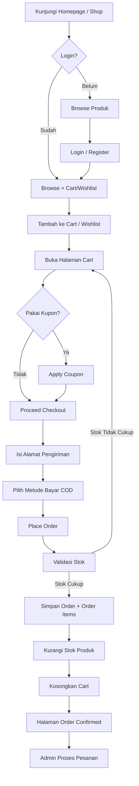
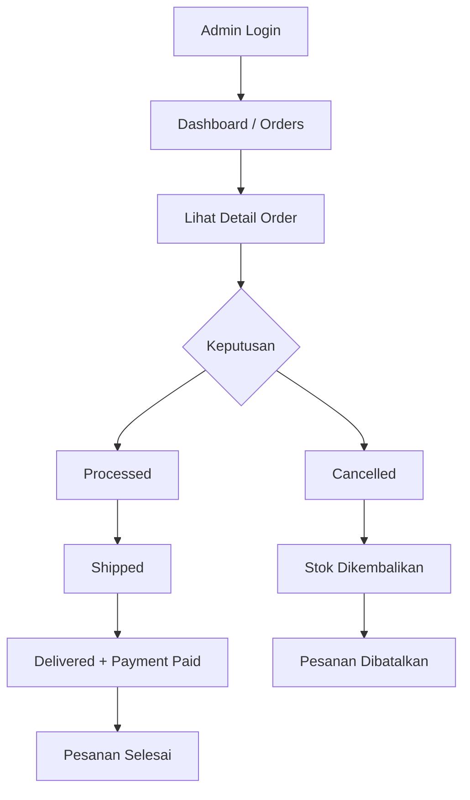
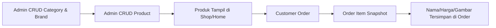

# E-Commerce Furniture Shop

Aplikasi **e-commerce furniture** berbasis web untuk menjual produk furnitur secara online. Sistem ini memisahkan peran **customer** (pembeli) dan **admin** (pengelola toko), dengan alur belanja dari browsing produk hingga konfirmasi pesanan.

Dibangun sebagai project pembelajaran/portfolio dengan fokus pada manajemen katalog, keranjang belanja, checkout, dan panel administrasi.

---

## Tech Stack


| Layer               | Teknologi                                                |
| ------------------- | -------------------------------------------------------- |
| Backend             | PHP 8.3+, Laravel 13                                     |
| Frontend interaktif | Livewire 3                                               |
| Database            | MySQL / SQLite (via `.env`)                              |
| Styling             | Bootstrap 5, custom CSS (`public/assets/css/custom.css`) |
| Asset build         | Vite                                                     |
| Auth                | Laravel session + role-based (`customer` / `admin`)      |


---

## Fitur Utama

### Halaman Publik (Tanpa Login)


| Fitur                     | Keterangan                                                                                                                     |
| ------------------------- | ------------------------------------------------------------------------------------------------------------------------------ |
| **Home**                  | Slider promo, kategori, brand, produk baru, produk featured, produk sale                                                       |
| **Shop**                  | Daftar produk dengan pagination, pencarian, filter kategori, filter sale/new/in-stock, sorting                                 |
| **Product Detail**        | Galeri gambar, harga reguler/sale, stok, deskripsi, produk terkait, toggle cart & wishlist (redirect ke login jika belum auth) |
| **Contact**               | Form kirim pesan ke database untuk dibaca admin                                                                                |
| **Customer Support Chat** | Widget WhatsApp floating (pojok kanan bawah) pada layout storefront                                                            |


### Customer (Login Required)


| Fitur                | Keterangan                                                                                |
| -------------------- | ----------------------------------------------------------------------------------------- |
| **Register & Login** | Registrasi akun customer, login session                                                   |
| **Cart**             | Tambah/kurang qty, hapus item, kosongkan cart, apply/remove kupon diskon                  |
| **Wishlist**         | Simpan produk favorit, tambah ke cart, hapus dari wishlist                                |
| **Checkout**         | Form alamat pengiriman lengkap (provinsi–kode pos), ringkasan order, metode bayar **COD** |
| **Order Confirmed**  | Halaman sukses setelah checkout dengan detail pesanan & ringkasan pembayaran              |
| **My Account**       | Dashboard, riwayat order, tab alamat/akun (UI template)                                   |
| **Order Detail**     | Detail pesanan milik user (produk, alamat, status)                                        |


### Admin (Role `admin`)


| Modul          | Keterangan                                                                   |
| -------------- | ---------------------------------------------------------------------------- |
| **Dashboard**  | Statistik order (total, pending, delivered, cancelled) + tabel order terbaru |
| **Categories** | CRUD kategori produk (nama, slug, gambar)                                    |
| **Brands**     | CRUD brand/merek                                                             |
| **Products**   | CRUD produk (harga, stok, gambar utama + galeri JSON, featured, soft delete) |
| **Orders**     | Daftar pesanan, detail pesanan, update status order                          |
| **Sliders**    | CRUD banner homepage                                                         |
| **Coupons**    | CRUD kupon (`percent` / `fixed`, minimum cart, tanggal expired)              |
| **Users**      | Daftar pengguna terdaftar                                                    |
| **Contacts**   | Daftar pesan dari form contact                                               |
| **Settings**   | Halaman pengaturan toko (UI)                                                 |


### Manajemen Status Pesanan (Admin)

Alur status yang didukung:

`pending` → `processed` → `shipped` → `delivered`

atau dibatalkan (`cancelled`) dari status `pending`, `processed`, atau `shipped`. Saat cancel, stok produk dikembalikan otomatis.

---

## Alur Proses Bisnis Sistem

### 1. Alur Customer (Belanja)




### 2. Alur Admin (Pemrosesan Order)




### 3. Alur Data Produk




> **Catatan:** Saat checkout, data produk di-*snapshot* ke tabel `order_items` (nama, slug, gambar, kategori, brand, harga) agar riwayat pesanan tetap akurat meskipun produk diubah atau dihapus kemudian.

---

## Kelebihan Project

1. **Arsitektur modern** — Laravel 13 + Livewire 3 (SPA-like tanpa API terpisah untuk mayoritas fitur).
2. **Pemisahan role jelas** — Middleware `admin` membatasi panel admin; customer hanya mengakses data order milik sendiri.
3. **Katalog lengkap** — Kategori, brand, produk dengan harga sale, stok, featured, multi-gambar, soft delete.
4. **Checkout realistis** — Validasi stok, penyimpanan alamat user, diskon kupon, pengurangan stok otomatis.
5. **Snapshot order item** — Riwayat pesanan tidak bergantung pada data produk yang masih aktif.
6. **UI storefront konsisten** — Desain kartu modern (mint background, primary `#f2a100`) di cart, checkout, wishlist, dan order confirmed.
7. **Factory & seeder** — Data dummy (10 kategori, 10 brand, 50 produk) untuk development/demo cepat.
8. **Widget support WhatsApp** — Saluran bantuan cepat untuk customer di halaman publik.

---

## Kekurangan & Keterbatasan

1. **Pembayaran terbatas** — Hanya **Cash on Delivery (COD)** yang aktif di UI; `bank_transfer` dan `e_wallet` masih dikomentari.
2. **Tabel `transactions` belum terintegrasi** — Migration ada, tetapi record transaksi **tidak dibuat** saat checkout.
3. **Tanpa payment gateway** — Belum ada Midtrans/Xendit/dll.; status `payment_status` di-update manual lewat alur admin (mis. `paid` saat delivered).
4. **Reset password & verifikasi email** — Belum diimplementasi (tercatat di backlog `daftar-list.txt`).
5. **Shipping cost** — Selalu `0` (gratis); kalkulator shipping di cart masih UI template (`wire:ignore`).
6. **Beberapa tab My Account** — Download, Payment Method, Address, Account Details masih konten template statis.
7. **Tanpa review/komentar produk** — Belum ada fitur UGC/rating.
8. **Dashboard admin tanpa grafik** — Statistik berupa angka & tabel, belum ada chart visual.
9. **Pencarian admin** — Belum ada search produk di navbar admin.
10. **Eager loading berat** — Beberapa model memakai `$with` global yang bisa memengaruhi performa di skala besar.

---

## Struktur Folder Penting

```
app/
├── Http/Middleware/AdminMiddleware.php
├── Livewire/
│   ├── Admin/          # Panel admin (CRUD & orders)
│   ├── Auth/           # Login & register
│   ├── User/           # Checkout, dashboard, order detail/confirmed
│   ├── Cart.php, Shop.php, Home.php, Wishlist.php, ...
│   └── Components/     # Navbar, footer, banner, form components
├── Models/             # User, Product, Order, Cart, Coupon, ...
database/
├── migrations/         # Skema tabel
├── factories/          # Category, Brand, Product, User
└── seeders/
resources/views/
├── layouts/            # app.blade.php, admin layout
├── admin/              # Views panel admin
├── user/               # checkout, dashboard, order-confirmed, ...
└── components/         # support-chat, navbar, sidebar, ...
public/assets/          # CSS/JS template toko
routes/web.php          # Semua route Livewire full-page
```

---

## Instalasi & Menjalankan Project

### Prasyarat

- PHP >= 8.3
- Composer
- Node.js & npm
- MySQL (atau gunakan SQLite default)

### Langkah

```bash
# Clone & masuk folder project
cd e-commerce-furniture-shop

# Install dependency
composer install
npm install

# Environment
cp .env.example .env
php artisan key:generate

# Konfigurasi database di .env (contoh MySQL)
# DB_CONNECTION=mysql
# DB_HOST=127.0.0.1
# DB_DATABASE=ecommerce_furniture
# DB_USERNAME=root
# DB_PASSWORD=

# Migrasi + seed data demo
php artisan migrate:fresh --seed

# Storage link (upload gambar produk/kategori)
php artisan storage:link

# Jalankan server
php artisan serve
npm run dev
```

Buka browser: `http://127.0.0.1:8000`

### Akun Demo (Seeder)


| Role     | Email             | Password   |
| -------- | ----------------- | ---------- |
| Admin    | `admin@gmail.com` | `password` |
| Customer | `user@gmail.com`  | `password` |


- Panel admin: `/admin/dashboard`
- Login customer: `/login`

---

## Route Penting


| URL                           | Deskripsi        |
| ----------------------------- | ---------------- |
| `/`                           | Homepage         |
| `/shops`                      | Katalog produk   |
| `/product-detail/{slug}`      | Detail produk    |
| `/contact`                    | Form kontak      |
| `/login`, `/register`         | Autentikasi      |
| `/user/cart`                  | Keranjang        |
| `/user/wishlist`              | Wishlist         |
| `/user/checkout`              | Checkout         |
| `/user/orders/{id}/confirmed` | Konfirmasi order |
| `/user/dashboard`             | Akun customer    |
| `/admin/dashboard`            | Panel admin      |


---

## Model Relasi (Ringkas)

```
User ──┬── Cart ── CartItems ── Product
       ├── Wishlists ── Product
       ├── Orders ── OrderItems (snapshot)
       ├── Address (1)
       └── Transactions (relasi ada, belum dipakai penuh)

Product ── Category, Brand (nullable)
Order ── payment_method, payment_status, order_status, alamat lengkap
Coupon ── type: percent | fixed, minimum cart_value
```

---

## Roadmap / Pengembangan Lanjutan

Berdasarkan backlog internal (`daftar-list.txt`):

- Reset password & verifikasi email
- Popup cart/wishlist/search di homepage
- Pencarian produk di navbar admin
- Rich text editor (Trix) untuk deskripsi produk
- Komentar/review produk
- Grafik di dashboard admin
- Field phone pada tabel users
- Integrasi payment gateway & tabel transactions

---

## Lisensi

Project ini menggunakan [MIT License](https://opensource.org/licenses/MIT) (sesuai `composer.json`).

---

## Referensi Desain

Inspirasi UI/UX storefront: [Vinoti Living](https://vinotiliving.com/id/collections/sale-furniture-accessories/products/milan-top-marble-dining-table)

## Templete yang digunakan
Templete Laravel-12-E-Commerce-Project: [surfsidemedia](https://github.com/surfsidemedia/Laravel-12-E-Commerce-Project)